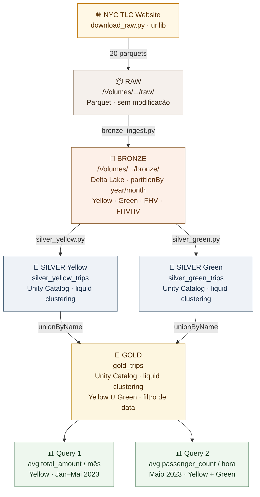
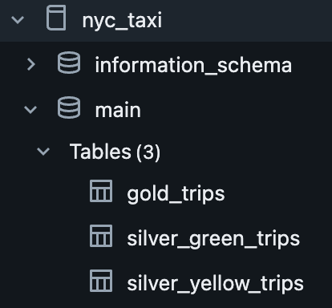

# NYC Taxi Pipeline

Pipeline de dados estruturado em Medallion Architecture (Bronze / Silver / Gold) sobre dados públicos de corridas de táxi de Nova York (Jan-Mai 2023), utilizando PySpark, Delta Lake e Databricks com Unity Catalog.


---

## Visão Geral da Arquitetura



### Camadas

| Camada | Localização | Formato | Registro no Catálogo | Propósito |
|--------|-------------|---------|----------------------|-----------|
| Raw | `/Volumes/nyc_taxi/main/data/raw/` | Parquet | Não | Cópia bruta dos arquivos originais |
| Bronze | `/Volumes/nyc_taxi/main/data/bronze/` | Delta Lake | Não | Dados tipados, sem transformação de negócio |
| Silver | Unity Catalog (gerenciado) | Delta Lake | Sim, com metadados | Dados limpos, schema canônico por fonte |
| Gold | Unity Catalog (gerenciado) | Delta Lake | Sim, com metadados | Tabela unificada, pronta para análise |

---

## Estrutura do Repositório

```
nyc-taxi-pipeline/
├── src/
│   ├── ingestion/
│   │   ├── download_raw.py        # Download dos parquets NYC TLC via urllib
│   │   └── bronze_ingest.py       # Raw parquets → Bronze Delta (PySpark)
│   ├── transformation/
│   │   ├── transforms.py          # Funções compartilhadas (filter, deduplicate, select)
│   │   ├── silver_yellow.py       # Bronze Yellow → Silver Yellow (Unity Catalog)
│   │   ├── silver_green.py        # Bronze Green → Silver Green (Unity Catalog)
│   │   └── gold_trips.py          # Silver → Gold (UNION + filtro de data)
│   └── quality/
│       └── checks.py              # Validações básicas de data quality
├── analysis/
│   ├── eda_raw_exploration.ipynb  # Análise exploratória dos dados brutos
│   ├── results.ipynb              # Queries obrigatórias com visualizações e insights
│   ├── query1_avg_total_amount.sql
│   └── query2_avg_passengers_by_hour.sql
├── notebooks/
│   └── pipeline_steps.ipynb       # Notebook Databricks com execução passo a passo
├── config/
│   ├── settings.py                # Paths, URLs e constantes centrais
│   └── setup_catalog.py           # Setup único: cria schema e volume no Unity Catalog
├── docs/
│   └── catalog_screenshot.png     # Screenshot do Unity Catalog com as tabelas registradas
├── README.md
└── requirements.txt
```

---

## Análise Exploratória

Disponível em `analysis/eda_raw_exploration.ipynb`. Cobre schemas, tipos, nulos, datas corrompidas, outliers de `total_amount` e estrutura de FHV/FHVHV. As descobertas embasaram as decisões de design abaixo.

---

## Execução

### Pré-requisitos

- Conta no [Databricks Free Edition](https://www.databricks.com/try-databricks)
- Cluster criado (Runtime 13.x LTS ou superior, com Delta Lake nativo e Unity Catalog)

### Importar o repositório

1. Acesse **Workspace → Import**
2. Faça upload do `.zip` do repositório ou importe via Git URL

### Executar o pipeline

Abra `notebooks/pipeline_steps.ipynb` e execute as células em ordem. O notebook cobre setup do catálogo, download dos dados, ingestão Bronze, transformação Silver/Gold, validação e queries analíticas.

---

## Decisões Técnicas

### 1. Medallion Architecture com Source-Aligned Silver

Yellow e Green são mantidos como tabelas separadas no Silver, seguindo o padrão *source-aligned Silver*. Isso garante:

- **Isolamento de falhas**: se Yellow quebra, Green não é afetado
- **Lineage explícita**: cada registro da Gold é rastreável à sua fonte Silver
- **Schema drift contido**: a harmonização ocorre em um único ponto (Gold)

**Desvio do padrão:** o padrão recomendado é um schema por camada (`nyc_taxi.bronze`, `nyc_taxi.silver`, `nyc_taxi.gold`), o que permite controle de acesso por camada via `GRANT ON SCHEMA`. Neste projeto, todas as tabelas ficaram em um único schema `nyc_taxi.main` por simplificação do setup. Em produção, o certo seria criar schemas separados por camada.

### 2. FHV e FHVHV apenas no Bronze

FHV e FHVHV (Uber, Lyft, etc.) foram ingeridos na camada Bronze para preservar os dados brutos, mas não são processados na Silver ou Gold por incompatibilidade de schema:

- **FHV**: não possui `passenger_count` nem `total_amount`
- **FHVHV**: usa `base_passenger_fare` em vez de `total_amount`, e não possui `passenger_count`

Para as queries obrigatórias, "todos os táxis da frota" equivale a Yellow + Green, as únicas fontes com os campos necessários. Isso está documentado nos comentários dos arquivos SQL.

### 3. Delta Lake em Todas as Camadas

Delta Lake foi escolhido sobre Parquet puro por:

- **ACID transactions**: garantia de consistência na escrita
- **Schema enforcement**: rejeita dados com schema incorreto
- **`replaceWhere`**: overwrite granular por partição para idempotência (Bronze)
- **Time travel**: capacidade de consultar versões anteriores se necessário

### 4. Sem Schema Explícito na Bronze (inferência + normalização)

O NYC TLC altera schemas entre meses: `VendorID` e `passenger_count` chegaram como `INT64` em alguns meses e `DOUBLE` em outros. A solução: ler sem schema, normalizar tipos inteiros para `Double` via `_normalize_types()`, e usar `mergeSchema=true` no write da Bronze para acomodar colunas novas sem reescrever a tabela. `mergeSchema=true` respeita o `replaceWhere` de idempotência.

### 5. Idempotência

A Bronze usa `replaceWhere("year = {year} AND month = {month}")` com `partitionBy("year", "month")`: cada execução sobrescreve apenas a partição do mês processado sem afetar os demais. Re-execução produz resultado idêntico. O `partitionBy` é indispensável aqui: sem partições físicas, o Delta precisaria escanear a tabela inteira para localizar os arquivos do predicado, perdendo o isolamento por mês.

Silver e Gold fazem full overwrite (`mode("overwrite")` sem `replaceWhere`) por simplicidade: o dataset é fixo e pequeno, então reconstruímos tudo a cada run.

### 6. Renomeação das Colunas de Data no Schema Canônico

Yellow usa `tpep_pickup_datetime`; Green usa `lpep_pickup_datetime`. Ambas foram renomeadas para `pickup_datetime` e `dropoff_datetime` no schema canônico da Silver, permitindo o `unionByName` na Gold sem transformação adicional.

### 7. Módulo Compartilhado de Transforms e Deduplicação na Silver

As funções `filter_valid_records`, `deduplicate_trips` e `select_canonical_columns` são compartilhadas entre `silver_yellow.py` e `silver_green.py` via `src/transformation/transforms.py` para garantir as mesmas transformações nas duas Silvers.

### 8. Filtro de Data Aplicado na Gold, não na Silver

A exploração inicial revelou registros com `pickup_datetime` em anos como 2001, erros de input do motorista. A decisão de onde filtrar envolve um tradeoff:

- **Filtrar na Silver**: impede propagação do lixo, mas perde rastreabilidade; não é possível auditar quantos registros corrompidos existiam
- **Filtrar na Gold**: Silver preserva todos os registros tecnicamente válidos (não-nulos, total_amount ≥ 0), inclusive os com datas absurdas, para auditoria futura

Optou-se por filtrar na Gold (`pickup_datetime >= PIPELINE_START_DATE`), mantendo a Silver como camada de dados limpos, mas completos. O valor de `PIPELINE_START_DATE` é centralizado em `config/settings.py`.

### 9. Liquid Clustering em vez de Particionamento (Silver e Gold)

O Databricks recomenda liquid clustering para todas as novas tabelas Delta. Para tabelas abaixo de 1 TB, particionamento tradicional geralmente prejudica mais do que ajuda: com apenas 5 meses de dados, cada partição teria ~100-200 MB, bem abaixo do mínimo recomendado de 1 GB por partição.

**Liquid clustering** substitui `partitionBy` + `ZORDER BY` num único mecanismo. As clustering keys são declaradas via `ALTER TABLE ... CLUSTER BY (pickup_datetime)` e o `OPTIMIZE` (sem `ZORDER`) reorganiza os arquivos automaticamente. Vantagens:

- Sem over-partitioning para datasets pequenos
- Clustering keys podem ser alteradas sem reescrever dados

**Por que `pickup_datetime` como clustering key:** a Query 2 agrupa por `HOUR(pickup_datetime)`; co-localizar registros por datetime reduz os arquivos lidos por hora do dia.

**Bronze mantém `partitionBy`** porque o `replaceWhere` de idempotência depende de partições físicas (ver Decisão 5). Liquid clustering é incompatível com `partitionBy`.

| Camada | Estratégia | Justificativa |
|--------|-----------|---------------|
| Bronze | `partitionBy("year", "month")` | Necessário para `replaceWhere` idempotente |
| Silver Yellow | Liquid clustering `(pickup_datetime)` | < 1 TB, full overwrite, sem `replaceWhere` |
| Silver Green | Liquid clustering `(pickup_datetime)` | Idem |
| Gold | Liquid clustering `(pickup_datetime)` | Idem |

### 10. Colunas de Lineage em Todas as Camadas

Cada camada adiciona colunas de auditoria: Bronze captura `_ingested_at`, `_source_file` e `_source_system`; Silver propaga `_bronze_source_file` e adiciona `_silver_processed_at`; Gold registra `_computed_at`. Descrições das colunas estão disponíveis no Unity Catalog via `DESCRIBE TABLE EXTENDED`.

### 11. Metadados no Unity Catalog

Todas as tabelas Silver e Gold registradas no Unity Catalog incluem:

- Descrição da tabela (`COMMENT ON TABLE`) com fonte, período, filtros aplicados e decisões arquiteturais
- Comentário por coluna (`ALTER TABLE ... ALTER COLUMN ... COMMENT`) para todas as colunas, incluindo as colunas de lineage (`_bronze_source_file`, `_silver_processed_at`, `_computed_at`)

Os metadados ficam visíveis na interface do Databricks em **Catalog → Tables → Columns** e são consultáveis via `DESCRIBE TABLE EXTENDED`.

<p align="center"></p>

---

## Possíveis Melhorias Futuras

| Melhoria | Justificativa | Complexidade |
|----------|---------------|--------------|
| Processar FHV e FHVHV no Silver | Expandir para incluir Uber/Lyft; requer harmonização de `base_passenger_fare` → `total_amount` e tratamento da ausência de `passenger_count` | Alta |
| Pipeline incremental em todas as camadas | Silver e Gold hoje fazem full overwrite; incrementalizar evitaria reprocessamento em cenário de dados chegando continuamente | Média |
| Orquestração com Airflow ou Databricks Workflows | Automatizar execução mensal com dependências entre etapas; pré-requisito para pipeline incremental | Média |
| Star schema na Gold (dim_vendor, dim_date) | Suportar queries analíticas mais complexas com joins de dimensão | Média |
| Great Expectations para qualidade de dados | Substituir checks manuais por suite de validações declarativa | Média |
| Análise exploratória adicional | EDA sobre gorjetas, distâncias, zonas de pickup/dropoff | Baixa |

---

## Fontes dos Dados

- [NYC TLC Trip Record Data](https://www.nyc.gov/site/tlc/about/tlc-trip-record-data.page)
- Período: Janeiro a Maio de 2023
